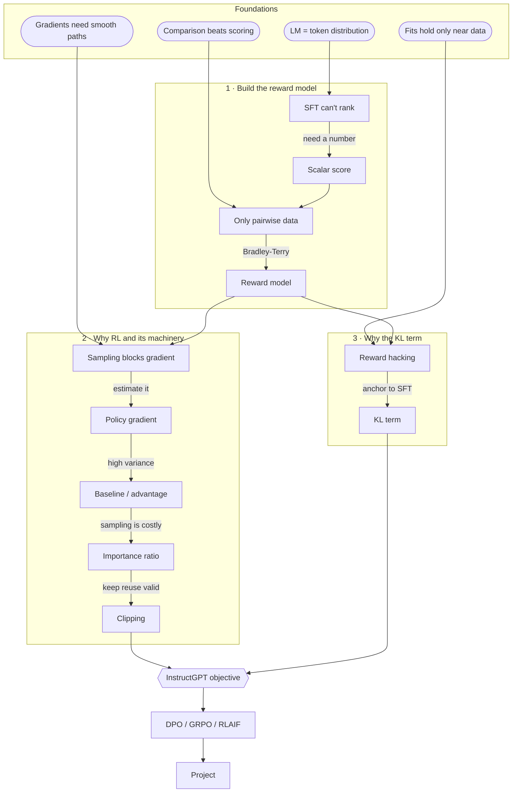

# The dependency map

The Phase 2 map is the plan's backbone as a DAG: unconditional truths at the roots, each derived node hanging off what it depends on, the goal as the sink. It is also the teaching order — Phase 3 builds it node by node.

It is the one artifact the learner uses to approve or reject the plan, so it has to be *readable*. Most of them aren't. This file is the construction procedure that fixes that.

## Why maps come out unreadable

**Width is the only budget.** Notion renders the diagram into a fixed-width column. Height is free — the page scrolls. Width is not: a diagram wider than the column is scaled down until it fits, and the text shrinks with it. So the widest rank in the graph sets the font size for *every* node. One 55-character label doesn't just make its own box big; it makes every other box's text smaller. A map dies of width, never of height.

**"Keep it small — few nodes" was the wrong constraint, and it caused the damage.** Node count isn't free to choose: the map *is* the teaching order, so it has exactly as many nodes as the lesson has steps. Told to keep the count down while still covering the lesson, the only move available is to merge steps into compound labels — which is where labels like

```
G["High variance → baseline → advantage"]
```

come from. Three teaching nodes crushed into one box. And the merge makes the diagram **lie**: those `→` inside the label are real dependency edges that the graph no longer draws. The reader now has to parse arrows at two levels at once, and the structure the map exists to show is precisely the structure that got hidden.

So: **budget per-label width. Never budget node count.** A 16-node map with four-word labels reads fine. An 8-node map with sentence labels does not.

## The procedure

1. **A node label is the *name* of an idea, not the *claim*.** Four words, ~28 characters, hard ceiling. `Reward model`, not `Bradley-Terry: posit latent r, fit on pairs → the reward model`. The claim belongs in the prose plan directly above the map — the map is an index into that prose, not a replacement for it.

2. **One claim per node, mechanically checkable.** If a label contains `→`, `:`, `;`, "so", "then", or "because", you have merged nodes that need splitting. Split every time. Shrinking a map by merging is always the wrong trade.

3. **The "why" goes on the edge.** `pg -->|high variance| base`. This is exactly what Principle ii says an edge *is* — the reason the next step was reachable. All the motivation that used to bloat node labels belongs here. Keep edge labels to three words; they cost width too.

4. **Mark roots by shape, not by text.** `lm(["LM = token distribution"])`. Delete every `ROOT:` prefix — six characters of the scarcest resource, spent restating what position on the page already shows.

5. **Give the goal a distinct shape** so the sink is findable at a glance: `obj{{"InstructGPT objective"}}`.

6. **Past ~8 nodes, group into phases with `subgraph`.** Take the phase names from the structure the prose plan already describes. Group *all* nodes or none — a half-grouped graph reads as an error. Subgraph titles are also width, so keep them short too.

7. **Declare every node first, then list every edge.** Two blocks, not interleaved. The edge list then sits in one place where you can read it back line by line — which is the only check that catches a reversed arrow, and nothing renders the diagram back to you before the learner sees it.

8. **Short mnemonic IDs, never serial letters.** `rm`, `kl`, `pg` — not `D`, `J`, `F`. The map gets edited in place when a root changes, and `D --> I` is unmaintainable and trivially easy to miswire.

9. **Core mermaid syntax only.** Nodes, edges, edge labels, `subgraph`, and the basic shapes. No `classDef`, no `style`, no theme directives, no HTML beyond `<br>`. You cannot render-test this before it ships, and a diagram that fails to parse is worse than a cluttered one.

10. **No LaTeX in labels.** It does not render in mermaid. Plain unicode like `β·KL` or `π_SFT` is fine; `$\beta$` is not. Notation belongs in the surrounding prose, which *is* rendered.

**The width check, before you emit:** find the longest label in the graph. Over ~28 characters and it's a sentence — cut it. Then count the widest rank: four roots at 30 characters each is a 120-character rank, and that is where legibility dies regardless of how good the individual labels are.

## Worked example

Real map from an RLHF lesson, and its repair.

**Before** — 17 nodes, labels up to 55 characters, four of them carrying `→` inside the box:

```
R4["ROOT: a fitted model is pinned down only where it had data"]
G["High variance → baseline → advantage"]
H["Sampling is costly → importance ratio → clipping"]
D["Bradley-Terry: posit latent r, fit on pairs<br/>→ the reward model"]
```

Every rule above is broken at once: claims as labels, merged nodes, motivation trapped inside boxes, `ROOT:` prefixes, serial IDs, no grouping.

**After** — 18 nodes (one *more*, because the merges got split), longest label 28 characters, every motivation on an edge:



The node count went **up** and the map got easier to read. That's the whole lesson: the merges were never buying legibility, they were buying a smaller number at the cost of the structure the diagram exists to show.

Note what the edge labels now carry — `high variance`, `sampling is costly`, `keep reuse valid`. That chain of motivations is the actual argument of the lesson, and in the before-version it was buried inside three node labels where it couldn't be seen as a chain at all.
